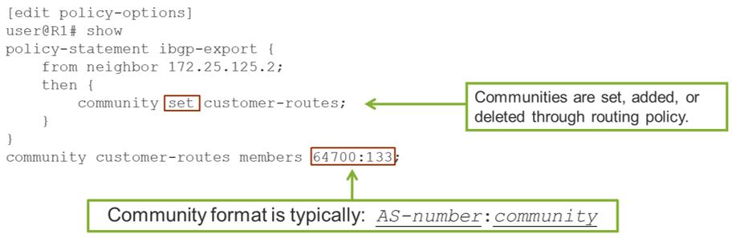

# Border Gateway Protocol (BGP)
- ## [Overview](#overview-1)
- ## [BGP Peers](#peers-1)
- ## [BGP Message Types](#messages-1)
- ## [Attributes](#attributes-1)
    - ### [Next-Hop](#next-hop-1)
    - ### [Local Preference](#local-preference-1)
    - ### [AS Path](#as-path-1)
    - ### [Origin](#origin-1)
    - ### [MED](#med-1)
    - ### [Community](#community-1)
- ## [Selecting the active BGP route](#select-active-1)
    
## **Overview**
- An **AS** is a set of routers that operate under the same administration.
- BGP is a classless routing protocol.
- Supports prefix routing.
- BGP peers must be connected directly for inter-AS routing.
- BGP version 4 is defined in **RFC 4271**.
- BGP is a path-vector routing protocol used for inter-domain routing.
    - uses an AS path, as a vector, to prevent inter-domain loops.
    - BGP routing information includes a series of AS numbers indicating the path that a route takes through the network.
    - BGP routing information includes the complete route to each destination.
    - BGP uses the routing information to maintain and information base of network layer reachability information (NLRI).
- BGP views the internet as a collection of Autonomous Systems (AS).
- Primarily used for inter-AS routing but also for MPLS-based VPNs or to separate large OSPF domains.
- BGP is normally used when a network has multiple upstream connections.
- **BGP uses TCP as its transport protocol (port 179)**.
## **BGP Peers**
- Peers can reside in the same of different ASs.
    - Peers in different ASs use the external session type (EBGP).
        - The connection between the two ASs consists of a physical connection and a BGP connection.
        - The physical connection is a shared data link laywer subnetwork between the two ASs.
        - The BGP connection exists between BGP speakers in each of the ASs.
        - **By default the EBGP connection is established between immediately connected devices located in two different ASs, because the TTL value of the EBGP packets is equal to 1.** The TTL can be increased by establishing a multihop BGP session.
    - Peers in the same AS use the internal session type (IBGP).
        - An IBGP connection is typically established between loopback interfaces of the routers not immediately connected. Loopback interfaces are used for stability reasons.
        - As BGP's TCP sessions are established using regular routing tables, and IGP is usually required inside the AS.
- BGP peering sessions are manually defined and rely on TCP sessions. **No automatic neighbor discovery**. 
- **BGP neighbor states**:
    - **Idle** state. The initial state when all incoming BGP connections are refused. A start event is required for the local system to initialize BGP resources and prepare for a transport connection with the other BGP peer.
    - **Connect** state. BGP is waiting for the transport protocol connection to be completed. If the transport protocol connection succeeds, the local system sends an **OPEN** message and transitions to the **OpenSent** state. If the connection fails, the local system restarts the ConnectRetryTimer, listens for a connection initiated by the remote BGP peer, and changes it's state to **Active**.
    - **Active** state. BGP is trying to aquire a peer by initiating a TCP connection. If the transport protocol connection succeeds, the local system sends an **OPEN** message and transitions to the **OpenSent** state. If it fails, you should check the physical connectivity and the configuration on both peers.
    - **OpenSent** state. BGP waits for an **OPEN** message from its peer. When this message is received, it checks for errors. If an error is found, the system trasitions back to **idle** state. If no errors are found, BGP sends a keepalive message.
    - **OpenConfirm** state. BGP waits for a **KEEPALIVE** or **NOTIFICATION** message. If no **KEEPALIVE** message is received before the negotiation timer expires, the local system sends out a **NOTIFICATION** message stating that the hold timer has expired and changes its state to **idle**. If a **NOTIFICATION** is received, it changes its state to **idle**. If a **KEEPALIVE** is received it changes state to **Established**.
    - **Established** state. BGP can exchange **UPDATE**, **NOTIFICATION** and **KEEPALIVE** messsages with its peer. When the local system receives and **UPDATE** or **KEEPALIVE** and when the negotiated hold timer value is nonzero, it restarts its hold timer. If the negotiated hold timer reaches 0, the local system sends out a **KEEPALIVE** message and restarts the hold timer.  
## **BGP Message Types**
- BGP messages are used to establish and maintain BGP peering sessions.
- All BGP messages use a commin header.
- BGP processes a message only after the entire message is received. Maximum message size is 4096 octets.
- The BGP header size is 19 octets.
- Message types:
    - **OPEN** message. Is sent once the TCP three-way handshake is complete. It initiates the BGP session and contains details about the BGP neighbor and information about supported and negotiated options.
    - **UPDATE** message. Used to transport routing information between peers.
        - An **UPDATE** message describes a single path and then multiple prefixes that can be reached through the same path.
        - BGP peers assume that this information is unchanged unless a subsequent update advertises a new path for a prefix or lists the prefix as unreachable.
        - If a neighbor goes down, the BGP speaker deletes all routes learned from that peer and updates its other peers accordingly.
    - **KEEPALIVE** message. Includes no data except for the header. Exchanged as needed to ensure the hold timer does not expire.
    - **NOTIFICATION** message. Used to signal that something is wrong. When an error is detected, the BGP session is closed. 
    - **REFRESH** message. Normally a BGP speaker cannot be made to readvertise routes that have been already sent and ACKd (using TCP). The route refresh message supports *soft clearing* of BGP sessions by allowing a peer to readvertise routes that havr already been sent.
## **Attributes**
**BGP Attributes** are included in the update message and describe the BGP prefixes received from a peer. They are used to select the best path.
|Name|Type|
|----|---|
|AS Path|Well-Known Mandatory|
|Local Preference|Well-Known Discretionary|
|MED|Optional Nontransitive|
|Origin|Well-Known Mandatory|
|Next-Hop|Well-Known Mandatory|
|Community|Optional transitive|
|Aggregator|Optional transitive|
Atomic Aggregator|Optional transitive|
|Cluster List|Optional Nontransitive|
Originator ID| Optional Nontransitive|

- Well-Known Mandatory - Must be supported by all BGP implementations and must be included in every BGP update.
- Well-Known Discretionary - Must be supported by all BGP implementations but do not have to be included in every BGP update.
- Optional Transitive - Not required to be supported by all BGP implementations but, if they are, they should be passed along, unchanged, to other BGP peers.
- Optional Nontransitive - Not required to be supported by all BGP implementations. If one such attribute is not recognized, it's ignored and not passed to other peers.
### **The Next-Hop Attribute**
- It is the IP address of the peer advertising the prefix. 
- Next-hop addresses must be reachable, in order for the receiving host to install the route in RIB-local.
- It is used to verify connectivity of a remote BGP peer.
- The next-hop value is tipically changed when the route is transmitted across EBGP links.
- IBGP peers do not alter the next-hop value between themselves. This can be altered using policy controls.
- Next-hop is always present for all BGP routes.
- BGP routes for which the next-hop is not reachable are placed in the routing-table as hidden routes. You can view them using the CLI command **show route hidden**.
### **The Local Preference Attribute**
- Determines the prefered path **out** of the AS.
- All BGP traffic in an AS flows toward the peer with the highest local preference value. This can be altered through BGP config or policy.
- Values are only used within an individual AS. Nothing is sent across EBGP links.
- The local preference attribute is a numeric value. Higher values indicate a better metric. Default value is 100.
- You can set it both through configuration and policy. If both are used, the policy takes precedence.
### **The AS Path Attribute**
- Used to indicate the path back to the route's source and to prevent routing loops.
- Routes with the receiving router's AS number in the AS path are considered looped and are not advertised (dropped).
- Each router on the edge of the AS ads its AS number to the fron of the path.
- Using route policy, you can prepend your ASN information to the AS-path attribute. By prepending your ASN multiple times you can affect routing decisions (you make the route longer so less prefered).
- AS-path is mandatory, always present.
### **The Origin Attribute**
- Added by the router that injected the route into BGP, and describes from where the route information was received.
    - I - IGP (0). Example IGPs are OSPF, EIGRP, IS-IS, static, aggregate.
    - E - EGP (1). EGP routes are form the original EGP (predecessor of BGP).
    - ? - Incomplete (2). Routes that did not come from an IGP or from EGP.
- Mandatory attribute, and transmitted across all BGP links. By default Junos OS assigns all routes injected into BGP an origin value of I. You can alter this behavior using routing policy.
### **The Multi-Exit Discriminator (MED) Attribute**
- Used to help influence the prefered way back **into** an AS when multiple links exist between the same two ASs.
- Can be altered through BGP configuration or policy.
- Lower values are better.
- The local AS sets the MED value differently on separate peers headed toward the same remote AS. The remote AS picks routes based on the lowest MED value it finds.
- BGP routes do not require the MED attribute. If it is missing, BGP assumes it to be 0.
- To configure a MED metric, you can either use the **metric-out** statement at the BGP protocol, group or neighbor level, or define and apply a routing policy that alters the MED value using **metric** as an action in the **then** statement.
### **The Community Attribute**
- Used to tag certain routes so that they can easily be identified.
- Defined under **[edit policy-options]** hierarchy.
  
- A BGP community is an identifier that represents a group of destination prefixes that share a common property.
- You can associate multiple communities with the same BGP route.
## **Selecting the active BGP route**