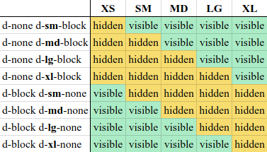

# Import it
```html
<script src="https://cdn.jsdelivr.net/npm/jquery@3.5.1/dist/jquery.slim.min.js" integrity="sha384-DfXdz2htPH0lsSSs5nCTpuj/zy4C+OGpamoFVy38MVBnE+IbbVYUew+OrCXaRkfj" crossorigin="anonymous"></script>
<script src="https://cdn.jsdelivr.net/npm/popper.js@1.16.1/dist/umd/popper.min.js" integrity="sha384-9/reFTGAW83EW2RDu2S0VKaIzap3H66lZH81PoYlFhbGU+6BZp6G7niu735Sk7lN" crossorigin="anonymous"></script>
<script src="https://cdn.jsdelivr.net/npm/bootstrap@4.6.1/dist/js/bootstrap.min.js" integrity="sha384-VHvPCCyXqtD5DqJeNxl2dtTyhF78xXNXdkwX1CZeRusQfRKp+tA7hAShOK/B/fQ2" crossorigin="anonymous"></script>
```
---
# Grid system:

#### The numbers (1-12) represent a portion of the total width of any div.
#### All divs are divided into 12 columns, so, col-*-6 spans 6 of 12 columns (half the width), col-*-12 spans 12 of 12 columns (the entire width), etc. So, if you want two equal columns to span a div, write:
```html
<div class="col-xs-6">Column 1</div>
<div class="col-xs-6">Column 2</div>
```
#### Or, if you want three unequal columns to span that same width, you could write:
```html
<div class="col-xs-2">Column 1</div>
<div class="col-xs-6">Column 2</div>
<div class="col-xs-4">Column 3</div>
```
#### You'll notice the # of columns always add up to 12. It can be less than twelve, but beware if more than 12, as your offending divs will bump down to the next row (not .row, which is another story altogether).

#### You can also nest columns within columns, (best with a .row wrapper around them) such as:
```html
<div class="col-xs-6">
  <div class="row">
    <div class="col-xs-4">Column 1-a</div>
    <div class="col-xs-8">Column 1-b</div>
  </div>
</div>
<div class="col-xs-6">
  <div class="row">
    <div class="col-xs-2">Column 2-a</div>
    <div class="col-xs-10">Column 2-b</div>
  </div>
</div>
```
#### Each set of nested divs also span up to 12 columns of their parent div. NOTE: Since each .col class has 15px padding on either side, you should usually wrap nested columns in a .row, which has -15px margins. This avoids duplicating the padding and keeps the content lined up between nested and non-nested col classes.

- xs for phones in portrait mode (<34em)
- sm for phones in landscape mode (≥34em)
- md for tablets (≥48em)
- lg for desktops (≥62em)
- xl for desktops (≥75em)

#### Read the [Grid Options](https://getbootstrap.com/docs/4.0/layout/grid/#grid-options) chapter from the official Bootstrap documentation for more details.

#### You should usually classify a div using multiple column classes so it behaves differently depending on the screen size (this is the heart of what makes bootstrap responsive). eg: a div with classes col-xs-6 and col-sm-4 will span half the screen on the mobile phone (xs) and 1/3 of the screen on tablets(sm).
```html
<div class="col-xs-6 col-sm-4">Column 1</div> <!-- 1/2 width on mobile, 1/3 screen on tablet) -->
<div class="col-xs-6 col-sm-8">Column 2</div> <!-- 1/2 width on mobile, 2/3 width on tablet -->
```
#### NOTE: as per comment below, grid classes for a given screen size apply to that screen size and larger unless another declaration overrides it (i.e. col-xs-6 col-md-4 spans 6 columns on xs and sm, and 4 columns on md and lg, even though sm and lg were never explicitly declared)

#### NOTE: if you don't define xs, it will default to col-xs-12 (i.e. col-sm-6 is half the width on sm, md and lg screens, but full-width on xs screens).

#### NOTE: it's actually totally fine if your .row includes more than 12 cols, as long as you are aware of how they will react. --This is a contentious issue, and not everyone agrees.
---
# Display property
#### [Link](https://getbootstrap.com/docs/4.0/utilities/display/)


---
# Spacing
#### [Link](https://getbootstrap.com/docs/4.4/utilities/spacing/)
#### Spacing utilities that apply to all breakpoints, from xs to xl, have no breakpoint abbreviation in them. This is because those classes are applied from min-width: 0 and up, and thus are not bound by a media query. The remaining breakpoints, however, do include a breakpoint abbreviation.

#### The classes are named using the format **{property}{sides}-{size}** for xs and **{property}{sides}-{breakpoint}-{size}** for sm, md, lg, and xl.

#### Where property is one of:

- m - for classes that set margin
- p - for classes that set padding
#### Where sides is one of:

- t - for classes that set margin-top or padding-top
- b - for classes that set margin-bottom or padding-bottom
- l - for classes that set margin-left or padding-left
- r - for classes that set margin-right or padding-right
- x - for classes that set both *-left and *-right
- y - for classes that set both *-top and *-bottom
- blank - for classes that set a margin or padding on all 4 sides of the element
#### Where size is one of:

- 0 - for classes that eliminate the margin or padding by setting it to 0
- 1 - (by default) for classes that set the margin or padding to $spacer * .25
- 2 - (by default) for classes that set the margin or padding to $spacer * .5
- 3 - (by default) for classes that set the margin or padding to $spacer
- 4 - (by default) for classes that set the margin or padding to $spacer * 1.5
- 5 - (by default) for classes that set the margin or padding to $spacer * 3
- auto - for classes that set the margin to auto
---
# Carousel
#### [Link](https://getbootstrap.com/docs/4.0/components/carousel/)
---