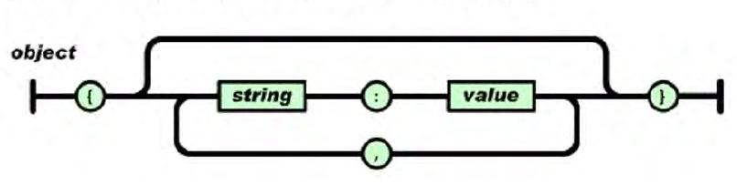
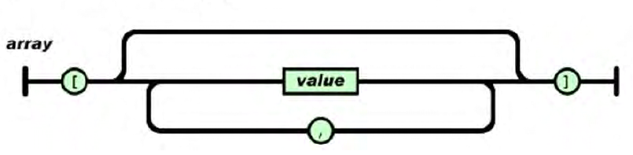
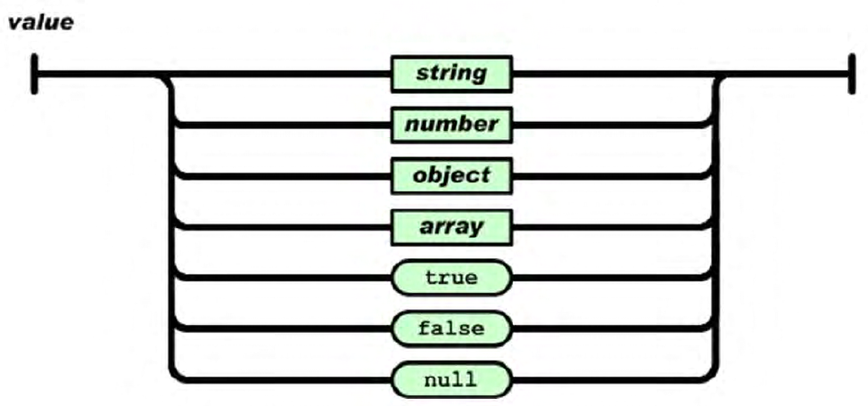
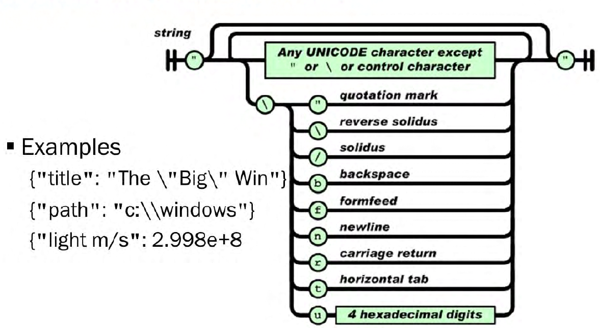

- It is case sensitive.
- Uses curly braces {} for structure.
- Whitespaces are ignored.
- No way to add comments
-Has the following structures:
    - Objects
    - Arrays

## JSON Objects 
Contain key-value pairs.

Example:
```json
{
 "interface" : "ge-0/0/0.0",
 "address" : "172.17.1.1/24"
}
```
Objects begin with and end with curly brackets. They are a collection of one or more key-value pairs. 
A key-value pair has an identifying key followed by a colon **:** and then a value.
A single object can contain a series of key-value pairs, separated by commas.
## JSON Arrays
Arrays encapsulate data in square brackets.

Example:
```json
{
 "physical-interface": [{
	   "name": [{
	      "data" : "ge-0/0/0"
	   }],
	   "admin-status": [{
	      "data" : "up"
	   }]
 }]
} 
```
An array is an ordered collection of values. They begin and end with square brackets. They contain one or more values. Array values are separated by commas.

The example above shows an object, and the object contains a key-value pair. The key is "physical-interface" and the value is an array. The array contains two objects.
## JSON Values
Objects and array values enable nesting.

## JSON Strings and Numbers

JSON strings can consist of any Unicode character except for double quotes and backslashes. You can use those too, but only if you escape them first (precede them with a backslash, like in C).

Numbers can be integers or floating point, with decimal points. You can express exponential numbers using E or e. Numbers enclosed in double quotes are treated as strings.